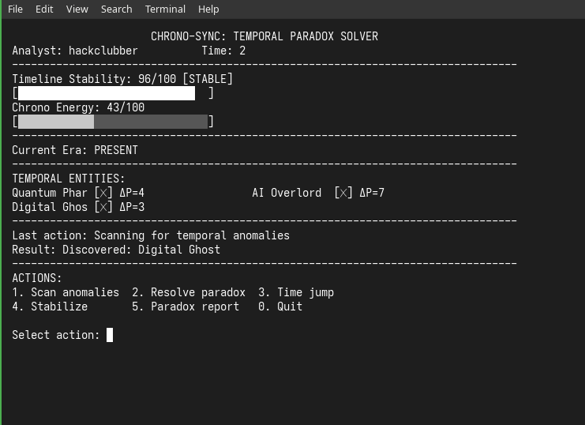

# Chrono-Sync: Temporal Paradox Solver



Chrono-Sync is a unique terminal-based time manipulation game where you play as a Temporal Analyst tasked with resolving paradoxes before the timeline collapses. This simplified version focuses on strategic resource management and temporal puzzle-solving in an accessible format.

## Installation

1. Clone the repository:

```bash
git clone https://github.com/piter231/chrono_sync.git
cd chrono_sync
```

2. Run the game:

```bash
python main.py
```

## Game Overview

You are a Temporal Analyst responsible for maintaining the integrity of the timeline. Anomalous entities from different time periods have appeared, creating paradoxes that threaten to unravel reality. You must:

1. Discover temporal entities
2. Resolve their paradoxes
3. Manage timeline stability
4. Prevent temporal collapse

## Game Rules

### Core Resources

- **Timeline Stability (0-100)**:
  - Decreases by 1-2 each turn
  - Game ends if reaches 0 (collapse)
- **Chrono Energy (0-100)**:
  - Increases by 1-2 each turn
  - Required for all actions

### Temporal Entities

6 entities with:

- **Name**: Unique identifier
- **Paradox Value (ΔP)**: Difficulty (3-7)
- **Time Period**: Historical era
- **Status**: ✓ (resolved) or ✗ (unresolved)

### Game Controls

| Action             | Key | Energy Cost | Effect                        |
| ------------------ | --- | ----------- | ----------------------------- |
| Scan for Anomalies | 1   | 10          | Discovers new entities        |
| Resolve Paradox    | 2   | ΔP × 4      | Starts resolution minigame    |
| Time Jump          | 3   | 20          | Travel to era (+10 stability) |
| Stabilize Timeline | 4   | 25          | Boost stability 15-25 points  |
| Paradox Report     | 5   | Free        | Show resolution progress      |
| Quit Game          | 0   | Free        | End simulation                |

## How to Play

### Basic Flow

1. Each turn, stability decreases (1-2) and energy increases (1-2)
2. Choose actions to:
   - Discover entities (Scan)
   - Resolve paradoxes (Resolve)
   - Stabilize timeline (Stabilize/Time Jump)
3. Win by resolving all paradoxes before stability reaches 0

### Paradox Resolution Minigame

When resolving:

1. Guess a "temporal frequency" (1-5)
2. You have 2 attempts
3. Feedback:
   - Exact match: Success!
   - Off by 1: "Close! Adjust slightly"
   - Off by 2+: "Way off! Try different approach"

**Example:**

```
Resolving Neo-Dinosaur's paradox...
Match the frequency (1-5)

Attempts left: 2
Enter frequency: 3
Close! Adjust slightly

Attempts left: 1
Enter frequency: 4
Success! Paradox resolved.
```

### Time Jump Mechanics

- Travel to historical eras:
  1. ANCIENT EGYPT
  2. JURASSIC
  3. FEUDAL JAPAN
  4. VICTORIAN
  5. PRESENT
  6. NEAR FUTURE
  7. DISTANT FUTURE
- Costs 20 energy
- Boosts stability by 10 points

## Strategy Guide

1. **Early Game**: Scan to discover all entities
2. **Prioritize**: Resolve low ΔP paradoxes first
3. **Stability Management**:
   - Use Stabilize when below 50
   - Time Jump when both energy and stability low
4. **Minigame Strategy**:
   - Start with 3 (statistically optimal)
   - If "Close", try adjacent numbers
   - If "Way off", try opposite end of range
5. **Energy Conservation**: Balance resolution attempts with stabilization

## Win Conditions

- **Win**: Resolve all paradoxes
- **Lose**: Timeline stability reaches 0

## Game Screens

**Main Interface:**

```
-------------------------------------------------------------------------------
TEMPORAL ENTITIES:
Quantum Phar [✓] ΔP=4  Neo-Dinosaur [✗] ΔP=6
Steam-Power  [✗] ΔP=5  Digital Ghos [✓] ΔP=3
-------------------------------------------------------------------------------
Last action: Scanning for anomalies
Result: Discovered: Time-Displaced Samurai
-------------------------------------------------------------------------------
ACTIONS:
1. Scan anomalies  2. Resolve paradox  3. Time jump
4. Stabilize       5. Paradox report   0. Quit
```

**Paradox Report:**

```
PARADOX RESOLUTION REPORT
-------------------------------------------------------------------------------
Resolved: 2/5
  ✓ Quantum Pharaoh
  ✓ Digital Ghost

Unresolved: 3/5
  ✗ Steam-Powered AI (ΔP=5)
  ✗ Neo-Dinosaur (ΔP=6)
  ✗ Time-Displaced Samurai (ΔP=5)
```

**End Game:**

```
          TIMELINE STABILIZED
   Congratulations, Temporal Analyst!

You successfully resolved all paradoxes
        Resolved: 5 paradoxes
        Final Stability: 68%

   Thank you for playing CHRONO-SYNC
```

## Customization

Modify game parameters in `main.py`:

```python
# Difficulty adjustments
self.timeline_stability = 100  # Starting stability
self.chrono_energy = 50        # Starting energy

# Entity pool (add/remove entities)
self.entity_pool = [
    TemporalEntity("Quantum Pharaoh", 4, "ANCIENT EGYPT"),
    TemporalEntity("Steam-Powered AI", 5, "VICTORIAN ERA"),
    # ... other entities ...
]

# Energy costs
SCAN_ENERGY = 10
RESOLVE_MULTIPLIER = 4
JUMP_ENERGY = 20
STABILIZE_ENERGY = 25
```

## Requirements

- Python 3.6+
- Windows, macOS, or Linux
- Terminal with basic text support

## License

[MIT License](LICENSE) - Free to modify and distribute

## Repository

[https://github.com/piter231/chrono_sync](https://github.com/piter231/chrono_sync)

```
     CHRONO-SYNC: TEMPORAL PARADOX SOLVER
  Resolve anomalies before time unravels...
```
